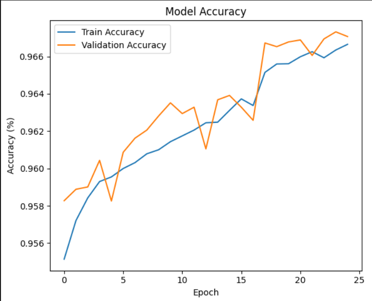
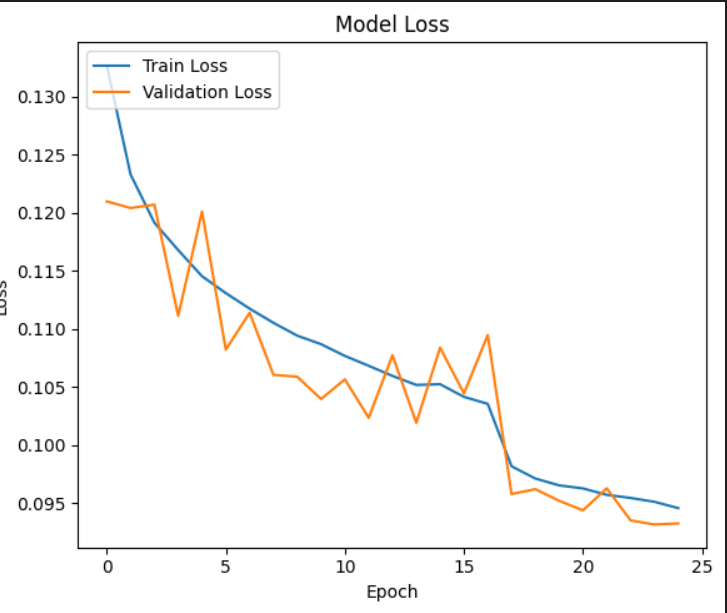

# MammoDetect: Breast Cancer Detection Using Convolutional Neural Networks (CNN)

## Project Overview

MammoDetect is a machine learning project designed to detect breast cancer using CNN models, leveraging both **mammography** and **histopathology** datasets. The primary focus is to classify breast images into cancerous and non-cancerous categories. The model is trained on both **CBIS-DDSM** mammography images and a histopathology dataset containing Invasive Ductal Carcinoma (IDC) regions, which are critical for cancer detection and grading.

---

### Table of Contents

1. [Dataset Description](#dataset-description)
2. [Data Preprocessing and Augmentation](#data-preprocessing-and-augmentation)
3. [Model Architecture](#model-architecture)
4. [Training and Evaluation](#training-and-evaluation)
5. [Example Predictions](#example-predictions)
6. [Usage Instructions](#usage-instructions)
7. [Contributing](#contributing)

---

## Dataset Description

### CBIS-DDSM Mammography Dataset

The **CBIS-DDSM** dataset provides high-resolution mammography images curated to support breast cancer detection research. Key details are as follows:

- **Number of Studies:** 6,775
- **Number of Images:** 10,239
- **Participants:** 1,566 unique individuals (with additional IDs based on imaging views)
- **Modality:** Mammography (MG)
- **Image Size:** 6 GB in JPEG format

### IDC Histopathology Dataset

The **IDC Histopathology** dataset focuses on Invasive Ductal Carcinoma, the most common subtype of breast cancer. This dataset includes labeled 50x50 pixel patches extracted from whole slide images to highlight IDC-positive and IDC-negative regions. 

- **Total Patches:** 277,524
  - **IDC Negative:** 198,738 patches
  - **IDC Positive:** 78,786 patches
- **Labeling Format:** Patch filenames encode patient ID, coordinates, and class (0 for IDC-negative, 1 for IDC-positive)

---

## Data Preprocessing and Augmentation

MammoDetect preprocesses images from both datasets by resizing, normalizing, and applying augmentations such as random rotation, affine transformation, and horizontal flipping to enhance the model's robustness.

### Sample Images

- **Cropped Mammography Image**
  - 
- **Full Mammogram Image**
  - 
- **ROI Mask Image**
  - 
- **Histopathology IDC Patch**
  - 

---

## Model Architecture

The custom CNN in MammoDetect consists of four convolutional layers with batch normalization, max pooling, and dropout layers, designed to classify both mammography and histopathology images into **Cancerous** and **Non-Cancerous** categories.

---

## Training and Evaluation

The model in MammoDetect was trained for 25 epochs with cross-entropy loss and an Adam optimizer. Training and validation performance are tracked with accuracy and loss metrics.

### Model Performance

- **Training Accuracy:** 96.665%
- **Validation Accuracy:** 96.706%

### Accuracy and Loss Plot

- **Training & Validation Accuracy**
  - 
  
- **Training & Validation Loss**
  - 

---

## Example Predictions

Here are example predictions made by MammoDetect on test images:

- **Prediction on Cancerous Mammogram**
  - 
- **Prediction on Non-Cancerous Mammogram**
  - 

---

## Usage Instructions

### Prerequisites

- Python 3.x
- Required libraries: `torch`, `PIL`, `pandas`, `matplotlib`, `plotly`, `seaborn`

### Steps

1. Clone this repository.
2. Download the **CBIS-DDSM** and **IDC Histopathology** datasets.
3. Preprocess and train the model using the provided script.
4. Use the inference function to make predictions on new images.

### Inference Example

```python

model = load_trained_model(model, model_path= 'CNN_model.pth')
image_path = 'path/to/image.jpg
predicted_class, cancer_probability = infer_image(model, image_path)
print(f'Predicted Class: {predicted_class}, Probability of Cancer: {cancer_probability:.4f}')

```

---

## Contributing

For contributions, please open a pull request or submit an issue for discussion.

---
